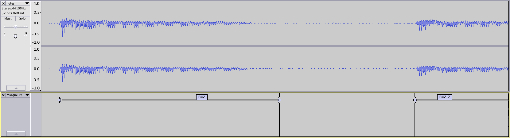
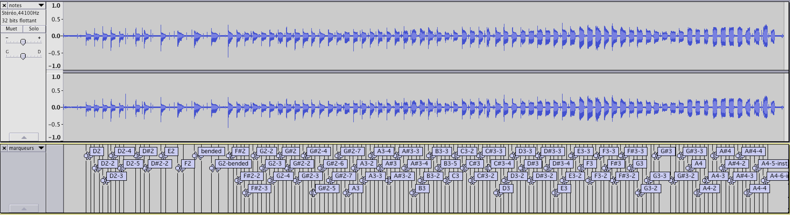

# Human Voice Dataset

A collection of human voice records based on various way of singing (note pitch, voyel, consonant, etc).

This dataset is built to ease research on voice-based musical controllers. It can help to benchmark voice feature detection algorithms (pitch detection, onset detection) as well as form a training corpus for machine learning algorithms.

Current version provides 1 singer records but the dataset will grow in future monthes.


## Voice features

Voice features are enumarated through various dimensions : notes form one dimension explored from lowest to highest possible range with semi tones intervals.  E.g. :
* c3.wav
* c#3.wav
* d3.wav
* ...

Voyels (i.e. formant), also form a dimension with finite values (a, e, i, ...). Voyels are available in separated files with names like
* _-a-[note].wav
* _-e-[note].wav
* _-i-[note].wav
* _-o-[note].wav
* _-ou-[note].wav
* _-u-[note].wav

Some features (e.g. consonants) require to be pronounced with a voyel to be understandable so we iterate over : 't' is not pronounced alone, it is used in 'ta', 'tu', 'to', etc.  
* t-a-[note].wav
* t-u-[note].wav
* t-o-[note].wav
* d-a-[note].wav
* d-u-[note].wav
* d-o-[note].wav
* ...


Said shortly each singer, the dataset provides <font color="gray">(gray indicate not-available-yet samples)</font>:
* notes : generally in note range C1-C3 resulting of 24 notes (over 1 voyels {a})
* <font color="gray">voyels : a, e, i, o, ou, u (over 2 note : {c3, f3})</font>
* <font color="gray">consonants (occlusives) : _ (none), b, c, d, f, g, l,m, n, p, q, r, s, t, v, w, y, z (for 1 voyels : {a}, over 2 note : {c3, f3})</font>
* <font color="gray">dynamics : volume change, pitch bend, vibrato</font>


## Dataset structure

Note name pattern

```
[consonant]-[voyel]-[note]-[dynamic].wav

consonant : _, t, d, b, l, ...
voyel     : a, e, i, ...
note      : c3, c#3, d3, ...
dynamic   : _, vibrator, bend, ...
```

Browse the dataset <a href="https://github.com/vocobox/human-voice-dataset/tree/master/data/voices/martin">online</a> or see the overview below :

data/voices/
* martin/
  * notes/
    * sources/
      * notes.wav
      * notes-markers.txt
      * recording.properties
      * singer.properties
    * exports/
      * mono-44100/
      * mono-22050/
        * c3-_-a.wav
        * c#3.wav
        * ...
  * voyels/
    * sources/
    * exports/
      * mono-44100/
        * _-a-c3.wav
        * _-a-c4.wav
        * _-a-c5.wav
        * _-e-c3.wav
        * _-i-c3.wav
        * _-o-c3.wav
  * consonants/
    * sources/
    * exports/
      * mono-44100/
        * b-a-c3.wav
        * b-e-c3.wav
        * b-a-g2.wav
        * b-e-g2.wav


[singer]/[serie]/sources/singer.properties
``` java
age : 34
gender : male
nationality : french
```

[singer]/[serie]/sources/recorder.properties
``` java
recorder : Roland R05
information : recording device at 20cm of the mouth
date : 2014
```

## Benchmarks

<a href="https://github.com/vocobox/vocobox/">Vocobox applications</a> allow to evaluate pitch detection in various ways : bulk evaluation on note datasets, live evaluation with microphone, etc.

See this <a href="https://github.com/vocobox/vocobox/blob/master/Benchmark.md">benchmark</a> to learn more on Human Voice Dataset pitch evaluation with TarsosDSP.


## Adding voices samples to the dataset

### Devices
For the first voice record, we simply used :
* a piano with a metronome and headphone to indicate note duration and height to the singer.
* a <a href="http://www.rolandus.com/products/details/1077">Roland R05</a> recording device standing at 20cm of the mouth of the singer.

### Recording
Each note is sung 3 to 10 times during 1 sec at tempo 60. A note serie is recorded in one file, saved in

```
[singer]/[serie]/sources/[name].wav
```

Informations about recording conditions are added in
```
[singer]/[serie]/source/record.properties
[singer]/[serie]/source/singer.properties
```

### Slicing notes
We use Audacity to precisely set voice event start and stop, and export sound slices for each note of the record.


Markers can be saved in text files (they can be reused in modified versions of the record : mono, lower quality, etc).


Markers stand next to the original record :
```
[singer]/[serie]/source/[name]-markers.txt
```

Splitted notes exported to :
```
[singer]/[serie]/exports/[version]/[name].wav
```

### Enhancing the dataset
To add samples to this dataset, simply follow these steps :
Clone this repository from your terminal

```
git clone https://github.com/vocobox/human-voice-dataset.git
```

copy your [singer] folder next to the other singers, and back to your terminal type
```
git add .
git add -u
git commit -m "[new singer] barbara"
git push origin master
```

You might wish to learn how to make <a href="https://help.github.com/articles/using-pull-requests/">pull-requests</a>

## Other usefull sound datasets

Piano notes dataset :
* <a href="http://www.tsi.telecom-paristech.fr/aao/en/2010/07/08/maps-database-a-piano-database-for-multipitch-estimation-and-automatic-transcription-of-music/">MAPS Database</a>

Singing Voice dataset :
*  http://www.isophonics.net/SingingVoiceDataset

Speech databases :
* http://www.speech.cs.cmu.edu/databases/
* http://voxforge.org/
* http://www-lium.univ-lemans.fr/en/content/ted-lium-corpus

Voices and instruments :
* http://mtg.upf.edu/download/datasets/irmas/
